# Node + MySQL

### What is this?

Bamazon is an Amazon-like CLI app created with Node and MySQL.

### How does it work?

Customer View                                                     | Actions (via prompt input)
----------------------------------------------------------------- | -----------------------------
Customer inputs the item's ID number and their desired quantities | Bamazon checks if there is enough inventory to fulfill the order and provides either a success message or an out-of-stock message

Manager View           | Actions (via prompt choices)
---------------------- | -----------------------------
View Products for Sale | View the full inventory
View Low Inventory     | View inventory items with quantities of 5 or less units
Add to Inventory       | Add units to an existing item's quantities
Add New Product        | Add a completely new item to the database
Exit                   | Exit prompt

### GIFs

Customer View - Purchase 
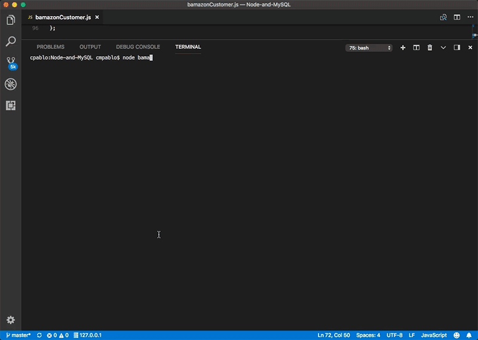

Customer View - Out-of-Stock 
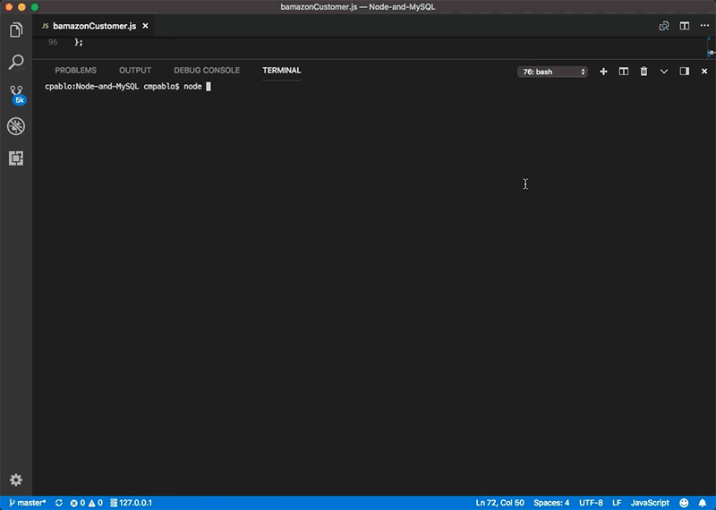

Manager View - View Products 
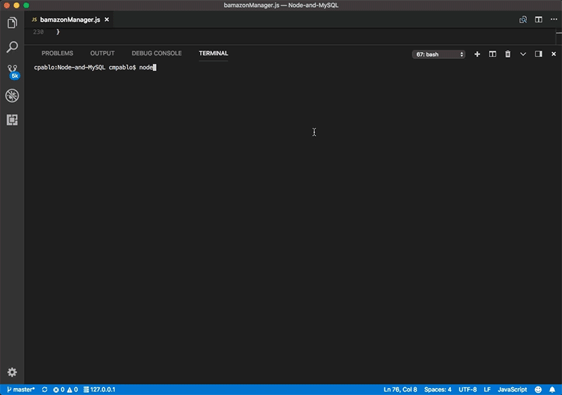

Manager View - View Low Inventory 
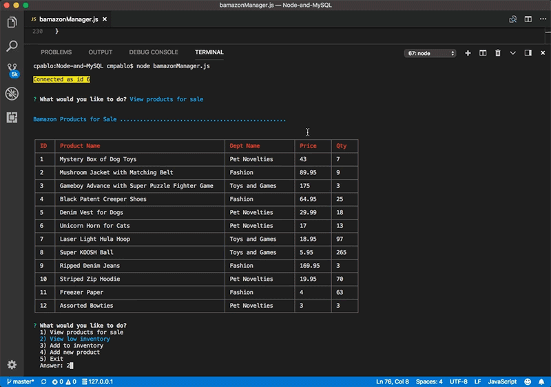

Manager View - Update Inventory 
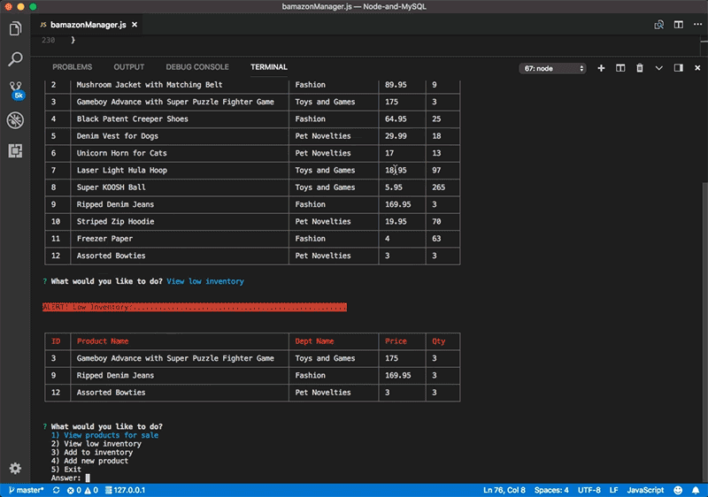

Manager View - Add New Item 
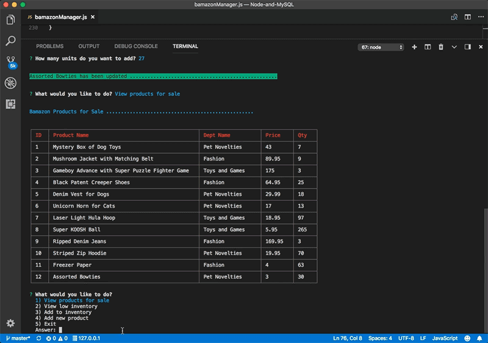

### Detail Screenshots

Customer View - Successful Purchase Message 
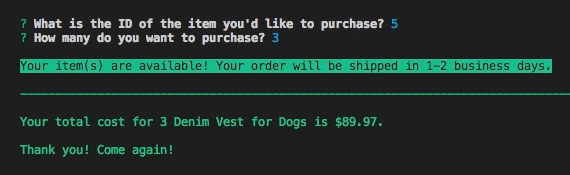

Customer View - Out-of-Stock Message 
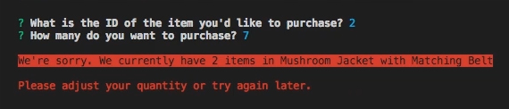

Manager View - Prompt 
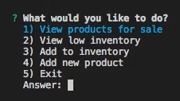

Manager View - Low Inventory Message 
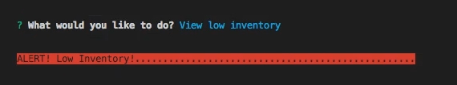

Manager View - Update Inventory Message 
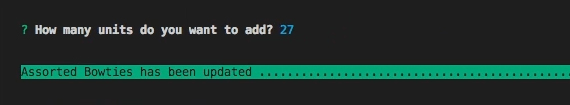

Manager View - Add New Product Message 
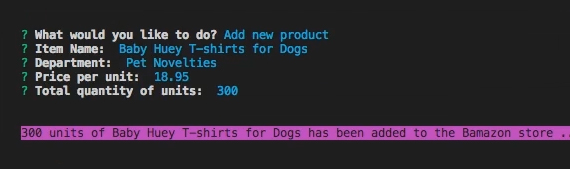

### Technologies Applied

* node.js
* JavaScript
* MAMP
* Sequel Pro
* Node Packages
    * MySQL
    * CLI Table
    * Inquirer
    * Chalk